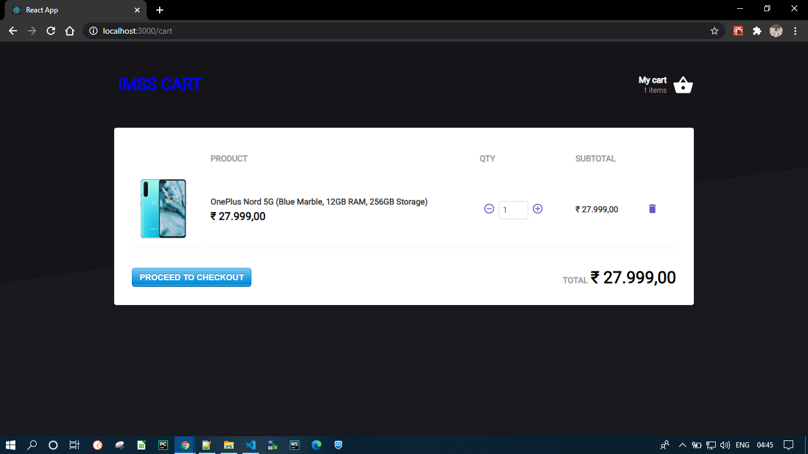
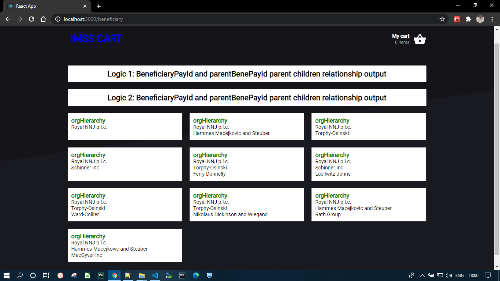

> E-Commerce like app showcasing react, hooks, redux and redux-sagas

## How to run (Steps)

```
1. git clone https://github.com/anil-pradhan143/imss-shopping-cart.git
2. Enter "cd imss-shopping-cart.git"
3. Install all dependencies by entering command "yarn install" or "npm install"
4. start json server for fake API by entering command "yarn jsonserver"  or "npm run jsonserver"
5. to execute or run the project enter "yarn start" or "npm start"
```


## Fake API server details
To get the fake api running, open another terminal and run `yarn jsonserver` or  `npm run jsonserver` so it will serve the `server.json` file as our API. This is being served on port `:4000`.

PS: you can access the routes from the fake api at, for example (on localhost), at `http://localhost:4000/products`, `http://localhost:4000/stock`. You can even access an specific product by passing its id as at `http://localhost:4000/products`. See more details on the _Json Server_ repository (link below). You can also add a delay to the response by using the `-d` flag followed by the amount of delay you want in miliseconds.


## Some dependencies/tools used

-   [ESLint](https://github.com/eslint/eslint)
-   [Prettier](https://github.com/prettier/prettier)
-   [EditorConfig](https://github.com/editorconfig/editorconfig)
-   [Styled Components](https://github.com/styled-components/styled-components)
-   [React Router Dom](https://reacttraining.com/react-router/web/guides/quick-start)
-   [Font Roboto](https://fonts.google.com/specimen/Roboto?selection.family=Roboto)
-   [React Icons](https://react-icons.netlify.com/#/)
-   [Polished](https://polished.js.org/) to darken some colors
-   [Json-server](https://github.com/typicode/json-server) to fake our API (we could use fetch api but dont have json placeholder url)
-   [Javascript's INTL](https://developer.mozilla.org/en-US/docs/Web/JavaScript/Reference/Global_Objects/Intl) to perform localization when formatting the price
-   [Reactotron](https://github.com/infinitered/reactotron) to debug the application's state
-   [Immer](https://github.com/immerjs/immer) which allow us to use mutable methods to create the next immutable state
-   [React Toastify](https://github.com/fkhadra/react-toastify) to display notifications on screen
-   [History](https://www.npmjs.com/package/history) to control the browser's history api. We use this inside the `<Router>` component and in the saga to navigate the user after the api call ends

## Screenshots React js Task l : 

1. Main route (`/`)

<p align="center">
  <!--  -->
  
</p>

2. Cart route (`/cart`)

<p align="center">
  <!--  -->
  
</p>

## Screenshots React js Task 2 : 

1. Beneficiary route (`/beneficiary`)

<p align="center">
  <!--  -->
  
</p>


## License

This project is licensed under the terms of the [MIT License](https://opensource.org/licenses/MIT) © Pablo Satler 2019

&emsp;

&emsp;

&emsp;

&emsp;

&emsp;

---

This project was bootstrapped with [Create React App](https://github.com/facebook/create-react-app).

## Available Scripts

In the project directory, you can run:

### `npm start`

Runs the app in the development mode.<br>
Open [http://localhost:3000](http://localhost:3000) to view it in the browser.

The page will reload if you make edits.<br>
You will also see any lint errors in the console.

### `npm test`

Launches the test runner in the interactive watch mode.<br>
See the section about [running tests](https://facebook.github.io/create-react-app/docs/running-tests) for more information.

### `npm run build`

Builds the app for production to the `build` folder.<br>
It correctly bundles React in production mode and optimizes the build for the best performance.

The build is minified and the filenames include the hashes.<br>
Your app is ready to be deployed!

See the section about [deployment](https://facebook.github.io/create-react-app/docs/deployment) for more information.

### `npm run eject`

**Note: this is a one-way operation. Once you `eject`, you can’t go back!**

If you aren’t satisfied with the build tool and configuration choices, you can `eject` at any time. This command will remove the single build dependency from your project.

Instead, it will copy all the configuration files and the transitive dependencies (Webpack, Babel, ESLint, etc) right into your project so you have full control over them. All of the commands except `eject` will still work, but they will point to the copied scripts so you can tweak them. At this point you’re on your own.

You don’t have to ever use `eject`. The curated feature set is suitable for small and middle deployments, and you shouldn’t feel obligated to use this feature. However we understand that this tool wouldn’t be useful if you couldn’t customize it when you are ready for it.
